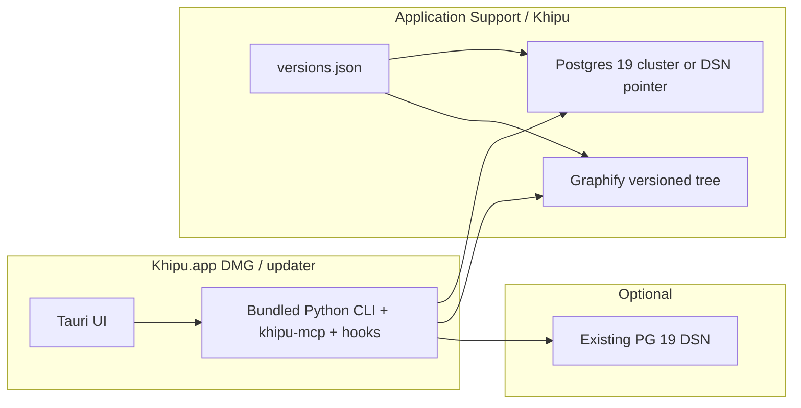

# Portable DMG Install Implementation Plan

> **For agentic workers:** REQUIRED SUB-SKILL: Use superpowers:subagent-driven-development (recommended) or superpowers:executing-plans to implement this plan task-by-task. Steps use checkbox (`- [ ]`) syntax for tracking.
>
> **This document is a plan.** Build authorized in-thread 2026-08-21 (`approved — build` via kickoff implement). Compatibility picks locked below.

**Status:** SHIPPED 2026-08-21 — Tasks 1–10 in-tree; public [`v0.3.0`](https://github.com/mrkinglollipop/Khipu/releases/tag/v0.3.0) GitHub Release (DMG + updater + `latest.json`). Notarized DMG **verified**. Graphify tarball + khipu-compat matrix published. GHCR `ghcr.io/mrkinglollipop/khipu-postgres:19beta3-pgvector` **not** published — GitHub tokens lack `write:packages`; installer `docker build` fallback remains. Clean-VM Welcome+doctor ACs **unverified**.

**Goal:** A generic user (Matt on a new Mac, or a stranger) can download one signed DMG, follow in-app install, and finish with a working Khipu: **PostgreSQL 19 + pgvector + SQL/PGQ**, a **Graphify** graph engine they can upgrade, memory capture/search, optional harness packs — **no** `/Volumes/Cloud Storage/...` paths, **no** required Linode, **no** required git clone of this repo.

**Architecture:** The `.app` is the **control plane and orchestrator**. Postgres 19 and Graphify are **separate versioned components** installed into `~/Library/Application Support/Khipu/` (or connected via DSN). The app bundles the Python CLI so hooks/MCP do not need a checkout. Upgrading the app must not be the only way to upgrade Postgres or Graphify.

**Tech Stack:** Tauri 2 + React desktop; Python 3.11 CLI (`packages/cli`); PostgreSQL **19** (currently **19beta3** + pgvector **0.8.6**); SQL/PGQ `CREATE PROPERTY GRAPH` / `GRAPH_TABLE`; Graphify nightly chain wrapped by `khipu graph-build`; macOS Keychain; GitHub Releases updater.

**Related SSOT (do not fork Goal):** Khipu-ops `plan.md` Goal (PG 19 + SQL/PGQ + pgvector); `scope.md` “install Khipu → point at Postgres”; fresh-install criteria in `plan.md` § Fresh-install / import. This slice **implements** those criteria. It does **not** replace PG 19 with 16/17/18.

## Global Constraints

- **PostgreSQL major floor is 19.** SQL/PGQ (`CREATE PROPERTY GRAPH`, `GRAPH_TABLE`) is the reason this product uses Postgres. Installer and doctor **refuse** any server whose `server_version_num` is `< 190000`. Never recommend or ship PG 16/17/18 as a local “good enough” mode.
- **As of 2026-08-21 (Docker Hub official `postgres` image, fetched this session):** tags for 19 are **`19beta3` / `19beta3-bookworm` / `19beta3-trixie` only**. Tag `latest` is **18.6**. Local install **must pin** `19beta3-bookworm` + our pgvector layer (`ops/docker/Dockerfile.pgvector`, pgvector **v0.8.6**). Do not pull `postgres:latest`.
- **When GA `postgres:19` exists:** upgrade path is the same as Linode beta2→beta3: `pg_dump -Fc` → rename live volume aside → empty new volume → **`CREATE EXTENSION vector`** → `pg_restore` → probe → sign-off (catalog bumps are not container swaps). Documented in Khipu-ops `ops/notes/pg19-install-runbook.md`. (Runbook’s open “`pg_upgrade` path” follow-up is **not** the portable installer procedure — portable uses dump/restore only.)
- **Graph is required.** Graphify builds structure; **Postgres 19 holds the live graph** via `khipu.graph_sync`. Users do not receive Matt’s `graph.sqlite` in the DMG.
- **Graphify and Postgres upgrade independently of the `.app`.** **Installed state** lives in `~/Library/Application Support/Khipu/versions.json`. The **compatibility matrix** is not that file.
  - **Floor (offline):** byte-copy of `docs/compat/khipu-graphify-postgres.json` at `Contents/Resources/khipu/info.json` — schema **exactly** `{"matrix":[...]}` (no pin list, no app semver). Running app semver comes from the Tauri binary.
  - **Integrity (sibling, not inside `info.json`):** `Contents/Resources/khipu/info.json.sha256` is the SHA-256 of that byte-copy (**Task 2** `bundle_cli.sh` writes both under Resources). Used only to detect a corrupted bundle.
  - **Refresh (no new DMG, must not steal app `/releases/latest`):** fetch from a **separate GitHub repo** `mrkinglollipop/khipu-compat` asset `https://github.com/mrkinglollipop/khipu-compat/releases/latest/download/khipu-graphify-postgres.json`. That repo’s `latest` is **only** matrix JSON (plus checksum). The **Khipu app** updater stays on `mrkinglollipop/Khipu/releases/latest/download/latest.json`. Never publish a docs-only tag on the **Khipu** repo that would become GitHub `latest` without `latest.json` + the current app tarball.
  - **Verify fetch:** HTTPS GET; compare SHA-256 to `https://github.com/mrkinglollipop/khipu-compat/releases/latest/download/khipu-graphify-postgres.json.sha256` on the **same** release (two files, same tag). Cache JSON to `~/Library/Application Support/Khipu/matrix.json`.
  - Effective allowlist = **union of rows** (bundled ∪ cached). Offline or fetch-fail → bundled floor only.
  - A Graphify or `khipu/postgres` image release that does not break the wrap API **must** cut a `khipu-compat` release with the updated JSON (no new `.app`).
- **Nothing personal to one maintainer.** No default path under `/Volumes/Cloud Storage/`, no baked `KHIPU_ROOT` of the build machine, no required Tailscale/Linode.
- **Linode / remote PG 19 is optional.** First-run offers **Local PG 19** or **Connect existing PG 19**.
- **Models are not Gemini-locked.** Gemini may be the convenient default. Synth/embed/vision are per-role Settings. Embed switch = new **profile** + re-embed job (locked 2026-08-05). First-run must allow local OpenAI-compat or “set later” (capture queues).
- **Aegis:** do not add/change Aegis packs from Khipu sessions (lock 2026-08-19). First-run agent list may detect Aegis; install remains the existing native pack only.
- **macOS arm64 is v1.** `latest.json` is `darwin-aarch64` only today.
- **Do not freeze the farm inside an opaque binary.** Bundling the CLI *inside* Resources is required so there is no git clone; bundling Postgres/Graphify *as the only copy with no upgrade channel* is forbidden.
- **Docker names (locked):** volume = **`khipu-pgdata`**; container = **`khipu-pg19`**. Never use the container name as the volume name. Channel table, Radio A, `versions.json`, and upgrade steps all use this pair.

---

## Current product (verified 2026-08-21) — the gap this plan closes

> **Baseline at plan start, not current product.** The table below is the 2026-08-21 inventory of gaps when this plan was written. Tasks 1–9 closed most of these in-tree; do not treat the “Today” column as live product state.

| Surface | Today | Portable target |
|---|---|---|
| GitHub Release | `Khipu.app.tar.gz` + `.sig` + `latest.json` | **Also** a **DMG** users can open (no plist inject) |
| `release_macos.sh` | **Deletes** Tauri DMG after LSEnvironment inject | **Skip** `LSEnvironment` inject; pack DMG from the un-injected app that already contains Resources CLI |
| `LSEnvironment` | Builder checkout + builder Homebrew Python | **Do not inject.** Release `khipu_root()` = `Contents/Resources/khipu` |
| Python CLI | Not in the `.app`; `PYTHONPATH` to checkout + `.python_libs` | Standalone 3.11 + wheels in Resources |
| Welcome Database | CLI `printf \| khipu secrets` (CLI missing) | In-app DSN paste **or** Local PG 19 installer |
| Welcome Model | Gemini paste only | Provider picker (cloud Gemini / local OpenAI-compat / skip) |
| Graphify | `jobs.py` default `/Volumes/Cloud Storage/Claude/UNIFICATION/scripts/graphify_nightly.py` | Versioned install under Application Support; `KHIPU_GRAPHIFY_NIGHTLY` set by installer |
| Doctor `backup_ok` | Requires `ops_events` WAL-G or `pg_dump` **and** `restore_drill` (Linode ops) | Local mode: Khipu records its own `pg_dump` + `restore_drill` before claiming green |
| Hardcoded sources seed | `sources.py` Claude/Memory Cloud Storage | Empty default sources; user adds folders |
| Launchd plists | Matt `KHIPU_ROOT` | Generated per-user Application Support paths |

Code anchors (**plan-start** inventory). Build **was approved 2026-08-21**; do not treat these as current product. `release_macos.sh` inject + delete is **plan-start**, not current:

- `apps/desktop/scripts/release_macos.sh` — **plan-start:** inject + delete DMG + publish tarball (**current:** skip inject; `recreate_portable_dmg` keeps a portable DMG)
- `apps/desktop/src-tauri/src/lib.rs` — `khipu_root()`, `run_khipu_cli()`, `SETTABLE_SECRETS` includes `database_url` but Welcome has no field
- `apps/desktop/src/Welcome.tsx` — five `StepId`s today (`welcome` / `database` / `model` / `agents` / `finish`); copy still says “four short steps”; Database is CLI-only. Portable target: add `graph` (six steps) and drop that copy.
- `packages/cli/khipu/jobs.py` — `GRAPHIFY_NIGHTLY` / consolidate / monthly / `BUILD_INDEX` Cloud Storage defaults
- `packages/cli/khipu/drift.py` — `backup_ok` via `ops_events`
- `ops/migrations/0001_core_schema.sql` — `CREATE EXTENSION vector` + `CREATE PROPERTY GRAPH alzy_graph`
- `ops/docker/Dockerfile.pgvector` — `FROM postgres:19beta3-bookworm`, pgvector v0.8.6

---

## Component channels (management model)

Three independently versioned channels. The app’s Settings → **Components** tab shows all three.



| Channel | Install location | How the user upgrades | Who owns the bits |
|---|---|---|---|
| **App + CLI** | `/Applications/Khipu.app` (`Contents/Resources/khipu` = CLI) | Settings → Check for updates (`tauri-plugin-updater` / `latest.json`) | GitHub Releases `vX.Y.Z` |
| **Postgres 19** | Docker volume **`khipu-pgdata`** **or** DSN to an existing 19 (container name **`khipu-pg19`**) | Components → Upgrade Postgres (dump/restore to new image tag) | Image `ghcr.io/mrkinglollipop/khipu-postgres:19beta3-pgvector` (then `19.x-pgvector` at GA) |
| **Graphify** | `~/Library/Application Support/Khipu/graphify/<semver>/` | Components → Upgrade Graphify (download next tarball; keep previous until doctor green) | GitHub Release **`mrkinglollipop/khipu-graphify`** asset `khipu-graphify-<semver>.tar.gz` (URL in matrix `graphify_tarball_url`) |

`versions.json` during Welcome Database → Graph (Radio A; `pending` **present**. **Implementation note:** Radio A `install_local_postgres` now writes `postgres.image` at Database; the plan originally delayed that promote until Graph):

```json
{
  "khipu_app": "0.3.0",
  "cli": "0.3.0",
  "pending": {
    "postgres_image": "ghcr.io/mrkinglollipop/khipu-postgres:19beta3-pgvector",
    "graphify_semver": "1.0.0",
    "graphify_tarball_url": "https://github.com/mrkinglollipop/khipu-graphify/releases/download/v1.0.0/khipu-graphify-1.0.0.tar.gz",
    "pgvector_min": "0.8.6"
  },
  "postgres": {
    "mode": "local_docker",
    "image": "ghcr.io/mrkinglollipop/khipu-postgres:19beta3-pgvector",
    "server_version": "19beta3",
    "pgvector": "0.8.6",
    "volume": "khipu-pgdata",
    "container": "khipu-pg19",
    "port": 54329
  }
}
```

Radio B `pending` omits `postgres_image` (remote DSN stores no local image tag).

`versions.json` after Graph success (`pending` **absent**; doctor reads this shape):

```json
{
  "khipu_app": "0.3.0",
  "cli": "0.3.0",
  "postgres": {
    "mode": "local_docker",
    "image": "ghcr.io/mrkinglollipop/khipu-postgres:19beta3-pgvector",
    "server_version": "19beta3",
    "pgvector": "0.8.6",
    "volume": "khipu-pgdata",
    "container": "khipu-pg19",
    "port": 54329
  },
  "graphify": {
    "semver": "1.0.0",
    "path": "/Users/you/Library/Application Support/Khipu/graphify/1.0.0"
  }
}
```

Remote DSN mode sets `postgres.mode` to `remote` and stores no local image tag; doctor still requires `server_version` ≥ 19 and a successful `GRAPH_TABLE` probe.

**`pending` lifecycle:** write at Database (Radio A or B). **Implementation (2026-08-21):** Radio A `install_local_postgres` now persists `postgres.image` at Database (the plan originally delayed that promote until Graph). After Graph step succeeds: copy `pending.postgres_image` → `postgres.image` if still missing (Radio A only), `pending.graphify_semver` → `graphify.semver`, then **delete the `pending` object**. If Graph fails: leave `pending` so Retry resumes; do not delete `pending`. Components upgrade never reads `pending` (uses installed `postgres` / `graphify`).

---

## User interaction — start to finish

Assume a Mac with no Khipu git clone, no Homebrew Python, no Cloud Storage volume, no Tailscale.

### 1. Acquire

This subsection is the **post-Task-10** stranger path. Until Task 10 ships `v0.3.0`, GitHub `/releases/latest` is still **0.2.9** (updater tarball, not a portable DMG). Mid-build review uses the **Task 3 local/CI DMG** (AC #1).

1. User opens `https://github.com/mrkinglollipop/Khipu/releases/latest`.
2. User downloads **`Khipu_<version>_aarch64.dmg`** (not only the updater tarball).
3. If Gatekeeper blocks: right-click → Open. Apple notarization credentials **were used 2026-08-21** (App Store Connect API key); Task 9 DMG is **notarized and stapled** (`spctl` Notarized Developer ID). Credentials are **not** still blocked. Public `v0.3.0` GitHub Release remains deferred until clean-VM ACs (Task 10). Unsigned-but-Developer-ID describes **0.2.9** only.

### 2. Install the app

1. Open DMG. Window shows Khipu icon + Applications shortcut (standard drag-install).
2. User drags `Khipu.app` to `/Applications`.
3. Eject DMG.
4. Launch `/Applications/Khipu.app`.
5. App must **not** look for the maintainer’s checkout. If Resources CLI is missing, show a single fatal screen: “This build is incomplete — re-download the DMG” (not a `KHIPU_ROOT is not set` pointing at `release_macos.sh`).

### 3. Welcome — Welcome

Copy already describes “from any of your Macs.” Keep that. Add one sentence: Postgres 19 is required (local or your own server); Graphify is installed as a separate upgradable engine.

### 4. Welcome — Database (fork)

**Radio A — Start a local Postgres 19 (default for strangers)**

1. App checks for a container runtime: Docker Desktop **or** OrbStack **or** Colima (`docker info`).
2. If none: show “Install Docker Desktop” (link to Docker’s current Mac Apple-silicon page) + **Recheck**. Do not silently install Docker (license/privilege). Recheck until `docker info` works **or** user switches to Radio B.
3. Before `docker pull`: if free disk is **less than 10 GiB**, show an **informational** warning (image + volume need headroom) + **Recheck**. Do not hard-block; user may continue after Recheck.
4. **Refresh matrix + choose row:** Welcome invokes fixed-argv **`select_compat_row`** (owner `components_matrix.py`; UI does **not** parse matrix JSON). Refresh (khipu-compat `releases/latest`; offline → bundled `info.json`). **Choose a full row** whose `khipu_app_min` ≤ this app (local Docker match, including `postgres_image`). If the effective matrix has **one** such row, auto-select it. If several, pick the row with the newest `postgres_image` that is still major 19 (semver-aware tag compare via `packaging.version`; if tags still tie, newest `graphify_semver`). Persist `versions.json` `pending.postgres_image`, `pending.graphify_semver`, `pending.graphify_tarball_url`, and **`pending.pgvector_min`** from **that same row**.
5. Pull **`pending.postgres_image`** (v1 single-row example: `ghcr.io/mrkinglollipop/khipu-postgres:19beta3-pgvector`). Recipe is `ops/docker/Dockerfile.pgvector`. Fallback if the public image is missing: `docker build -t <pending.postgres_image> -f "$KHIPU_ROOT/ops/docker/Dockerfile.pgvector" "$KHIPU_ROOT/ops/docker"` where **`KHIPU_ROOT` is the bundled** `Contents/Resources/khipu` from `khipu_root()` — never a git checkout path. Historical Linode tag `alzy/postgres:19beta3-pgvector` is **not** pulled.
6. Create volume **`khipu-pgdata`** mounted at **`/var/lib/postgresql`** (PG 18+ layout; do **not** mount `.../data` — runbook first-boot scar).
7. Run container **`khipu-pg19`**:
   - publish `127.0.0.1:<port>:5432` (localhost only, never `0.0.0.0`). Default port **54329**. If 54329 is in use, try **54330–54339** in order; persist the chosen port in `versions.json` (`postgres.port`). If the whole range is busy: error + Retry (do not bind `0.0.0.0` or a random high port).
   - `POSTGRES_USER=khipu` `POSTGRES_DB=khipu` `POSTGRES_PASSWORD=<generated 32-byte>`
   - `POSTGRES_HOST_AUTH_METHOD=scram-sha-256`
   - wait for `pg_isready`
8. Probe: `SELECT current_setting('server_version');` must start with `19`; `CREATE EXTENSION IF NOT EXISTS vector`; `SELECT extversion FROM pg_extension WHERE extname='vector'` must be **≥ `pgvector_min` of the chosen row**.
9. Store DSN in Keychain via existing `set_khipu_secret("database_url")` (Rust already allows this). Password never in `versions.json`. Write `postgres.mode=local_docker`, `postgres.server_version`, `postgres.pgvector` (from probe), `postgres.volume=khipu-pgdata`, `postgres.container=khipu-pg19`, `postgres.port=<chosen>`.
10. `khipu migrate` (not dry-run) until the SQL migration **`pending` list is empty** (`plan.pending.length === 0` / `migrate.py` `pending: []`). This is **not** `versions.json.pending` — that object **stays** until Graph success (see lifecycle). Confirm `alzy_graph` property graph exists (`0001_core_schema.sql`).
11. **Local backup bootstrap (doctor):** Welcome invokes fixed-argv **`bootstrap_local_backup`** (same pattern as `khipu_migrate`; not a generic `components` allowlist entry). Runs `pg_dump -Fc` into `~/Library/Application Support/Khipu/backups/pg/` and records `ops_events` `pg_dump` + a `restore_drill` against a throwaway container named **`khipu-pg19-drill`** and volume **`khipu-pgdata-drill`** (never reuse live `khipu-pg19` / `khipu-pgdata`). On the empty drill cluster: **`CREATE EXTENSION IF NOT EXISTS vector;` then `pg_restore`** (same order as runbook). Delete both on exit (success or fail). **`restore_drill` timeout = 10 minutes.** On fail: Welcome shows the error + **Retry**; Radio A **cannot** Finish with doctor green.

**Radio B — I already have PostgreSQL 19**

1. Paste DSN in the UI (password field; write Keychain). Optional `root.crt` file picker for `sslmode=verify-full`.
2. Recheck: connect and `server_version` ≥ 19. If version is 18 or lower: **hard fail** with copy: “Khipu needs PostgreSQL 19 for property graphs. This server is \<version\>.” Do **not** require `vector` / `GRAPH_TABLE` yet (those come from migrate on a fresh 19).
3. `khipu migrate` until the SQL migration **`pending` list is empty** (not `versions.json.pending`).
4. Probe **after migrate:** `vector` extension + `GRAPH_TABLE` sample (same query as `cli.py` graph depth-1). Fail → error + Retry.
5. **Refresh matrix + choose row:** Welcome invokes fixed-argv **`select_compat_row`** (remote mode), passing the **probed** `pgvector` `extversion` from step 4 (function does **not** re-probe the DSN). **Choose a full row** using the **remote** match (ignore `postgres_image`; require `pgvector ≥ pgvector_min`). If several rows match: pick the **newest `graphify_semver`** (`packaging.version`). Persist `versions.json` `postgres.mode=remote`, `postgres.server_version`, `postgres.pgvector` (from step 4 probe), `pending.graphify_semver`, `pending.graphify_tarball_url`, and **`pending.pgvector_min`** from that row. Do **not** set `pending.postgres_image`. If no row matches: error + Retry (cannot continue to Graph).
6. If `ops_events` backup rows missing: offer “Record a backup now” (`pg_dump` if the role can) or warn that doctor `backup_ok` stays red until the **server operator** records WAL-G/`pg_dump` + restore drill (current Linode behavior). Radio B may later **Continue with warnings** **only** when `backup_ok` is the **sole** red (see Finish).

### 5. Welcome — Model

1. Synth: Cloud Gemini (paste key) **or** Local OpenAI-compat (base URL + model id + optional `openai_compat_api_key`) **or** Skip (capture queues; existing Welcome copy).
2. Embed: explain profiles. Default may be Gemini Embedding 2 @768 **if** a Gemini key exists. Otherwise require choosing a local embed profile **or** Skip (semantic search empty until a profile is complete).
3. Do **not** block Finish solely on Gemini if they picked local or skip.
4. Embed Settings live-routing is **not** fully wired today (`embed.py` still uses active PG profile). Plan Task 7 includes making the chosen first-run embed profile **the active pointer** after first successful embed (empty corpus: coverage 0/0 is green).

### 6. Welcome — Graph engine

1. Welcome Graph invokes **`install_graphify`** (fixed argv; not `upgrade_graphify`). Install **`pending.graphify_semver`** by GETting **`pending.graphify_tarball_url`** (must be the matrix `graphify_tarball_url` for the Database-chosen row). If `pending.graphify_semver` or the URL is missing, go back to Database (Radio A or B **must** have persisted them). HTTP 404 / checksum fail → error + Retry; do not invent a default URL.
2. Unpack to Application Support; set `KHIPU_GRAPHIFY_NIGHTLY` to that tree’s `graphify_nightly.py`.
3. Default `graph_sources.json` = **empty list** (not Claude/Memory seeds).
4. Optional: “Add a folder to the graph” (existing corpus picker). First graph-build on empty sources is a no-op with a green explanation.
5. User can skip adding folders; graph **system** is still installed (requirement). Search of conversation memory still works from PG.
6. On success: **promote `pending` → installed** and **clear `pending`** (see `versions.json` lifecycle). On fail: leave `pending`; Retry uses the same URL.

### 7. Welcome — Agents

1. Detect Cursor / Claude Code / Codex (existing Integrations status). **Do not** auto-install Aegis (lock).
2. Button still opens Integrations; add **Install detected** that runs `khipu integrations install <harness>` for each detected non-Aegis harness.
3. Shims under `~/.config/khipu/bin/` must point at **`/Applications/Khipu.app/Contents/Resources/khipu/bin/*`**, not a git checkout.
4. Verify = real MCP `khipu_status` probe (existing).

### 8. Welcome — Finish

1. Run `khipu doctor`.
2. Local default (no memory_root, not sync-host, not graph-producer unless they added sources and opted in): `drift_ok` skip, `graph_drift_ok` skip, `backup_ok` from first-run dump+drill, `embed_coverage_ok` on empty corpus, `outbox_ok`, `dsn_file_ok`.
3. If red: name the failing key and a one-click retry. Do not say “green” with `backup_ok` false.
4. **`khipu.welcome.completed`:**
   - **Radio A (local default):** set **only** if doctor `ok`. No “Continue with warnings.” Failed `restore_drill` → error + Retry; Finish stays blocked.
   - **Radio B:** “Continue with warnings” (logged) is allowed **only** when `backup_ok` is the **sole** red (server-operator backups not yet recorded). Any other red blocks Finish.

### 9. Day-2 usage (same user)

- Status / Search / Graph / Doctor work against PG 19.
- Settings → Components: upgrade app / PG / Graphify separately.
- Settings → Check for updates: app only.
- Capture: `capture_mode=hub` default for new installs; `KHIPU_HUB_FILE_MIRROR=0` until they opt into a local wiki cache directory (Application Support `wiki/`, not Cloud Storage).
- Optional later: paste a remote DSN to **move** from local to Hub (export/import + migrate); document as a Components action, not first-run.

---

## Installation internals (what the DMG must contain)

```
Khipu.app/Contents/
  MacOS/khipu                 # Tauri binary
  Resources/
    khipu/
      python/                 # CPython 3.11 standalone (python-build-standalone, macOS arm64)
      lib/                    # pip wheels (psycopg, etc.) — arm64, rebuilt in CI
      packages/cli/           # khipu package (same as repo)
      bin/khipu               # wrapper: PYTHONPATH + python -m khipu
      bin/khipu-mcp
      bin/khipu-stop-hook
      bin/khipu-recall-hook
      bin/khipu-aegis-capture
      ops/migrations/         # so migrate works without a git clone
      ops/docker/Dockerfile.pgvector
      info.json               # byte-copy of docs/compat/khipu-graphify-postgres.json — {"matrix":[...]} only
      info.json.sha256        # checksum of info.json (bundle integrity; not a pin list of remote files)
  Info.plist                  # no builder KHIPU_ROOT / KHIPU_PYTHON
```

Release `khipu_root()` in `lib.rs` (release builds):

1. `KHIPU_ROOT` / `ALZY_ROOT` if set (power users).
2. Else `current_exe()/../Resources/khipu` if `packages/cli` exists there.
3. Else error: incomplete bundle.

`khipu_python()`: `Resources/khipu/python/bin/python3.11` first, then env, then `which python3` with 3.11+ gate.

Hooks/MCP already use `~/.config/khipu/bin` shims because of spaces in paths. Installer must recreate shims pointing at **Resources**, and Integrations must use `repo_root()` = that Resources tree.

`.python_libs` in a git checkout remains the **dev** path. Release never uses the builder’s `.python_libs`.

---

## Management — upgrades without trapping users in the app binary

### App upgrade

Existing: `latest.json` darwin-aarch64, Settings downloadAndInstall, relaunch. After portable ship, updater tarball **must** include Resources CLI (same un-injected app as the DMG; no `LSEnvironment` inject).

### Postgres upgrade

1. Refresh the effective matrix (fetch `https://github.com/mrkinglollipop/khipu-compat/releases/latest/download/khipu-graphify-postgres.json` + sibling `.sha256` on that same release; fall back to bundled `info.json` if offline). Never fetch the matrix from the **Khipu** app repo’s `/releases/latest`.
2. Components shows current image tag vs the newest **19.x** `postgres_image` in the **effective** matrix that also matches this app semver and the **installed** Graphify semver (full row). Multi-row local upgrade pick = **newest** major-19 `postgres_image` on a matching full row.
3. If the desired image is **not** on any full row: refuse (“publish a matrix asset first” — no silent pull).
4. User clicks Upgrade (`upgrade_postgres`). **Runbook order** (same as `pg19-install-runbook.md` beta2→beta3 — do **not** restore onto the live volume in place):
   1. `pg_dump -Fc` of the live DB.
   2. Stop container **`khipu-pg19`**. **Rename** live volume **`khipu-pgdata` → `khipu-pgdata-prev`** (and optionally rename the stopped container). The previous datadir must stay **unmodified** for rollback.
   3. Create empty volume **`khipu-pgdata`**. Pull the target image (never 18, never a tag absent from the matrix). Start a **new** `khipu-pg19` on that empty volume; wait `pg_isready`.
   4. **`CREATE EXTENSION IF NOT EXISTS vector;`** on the empty cluster (**before** `pg_restore` — dump references the type).
   5. `pg_restore` into the new cluster.
   6. Probe `server_version` ≥ 19 and `extversion` ≥ chosen row `pgvector_min`. **Portable count check:** TOC / table row counts for `episodes`, `topics`, `nodes`, `edges`, `embeddings`, `ops_events`, `schema_migrations` must match the pre-upgrade dump TOC (empty DB → all zero is OK).
   7. Doctor green / sign-off → **then** delete `khipu-pgdata-prev`. On any fail before sign-off: stop new container; **rename failed new volume** `khipu-pgdata` → `khipu-pgdata-failed-<ts>`; **rename `khipu-pgdata-prev` back to `khipu-pgdata`**; restart **pre-upgrade** image/container (capture pre-upgrade `postgres.image` / container image id **before** pull; do not write the target image into `versions.json` until sign-off). Retry.
5. **Refuse** any upgrade whose target major `< 19`.

### Graphify upgrade

1. Refresh the effective matrix (same fetch as Postgres upgrade).
2. Components shows installed semver vs the newest `graphify_semver` on a **full row** that matches this app + (local: installed `postgres_image`; remote: ignore image).
3. If none: refuse until a **`khipu-compat`** release lists that tarball.
4. GET the row’s **`graphify_tarball_url`** (never invent a URL). Unpack beside the old tree (`graphify/1.1.0` next to `1.0.0`).
5. Point `KHIPU_GRAPHIFY_NIGHTLY` at the new `graphify_nightly.py`.
6. Run `khipu graph-build` (or `--check` if sources empty).
7. Doctor `graph_drift_ok` if they are a producer; else skip remains OK.
8. Keep previous tree until user deletes it (rollback = flip path).

### Compatibility matrix

**Authoring SSOT:** repo file `docs/compat/khipu-graphify-postgres.json` (created in **Task 5b**, **before** bundling).

**On the Mac (effective allowlist):**
1. Bundled **byte-copy** at `Contents/Resources/khipu/info.json` — schema **exactly** `{"matrix":[...]}` (no extra keys for app semver).
2. Optional cache `~/Library/Application Support/Khipu/matrix.json` from **`khipu-compat`** GitHub `releases/latest` (not from the Khipu app repo).
3. Union of rows. **Pre-pull / pre-install (first-run local Docker):** refuse unless a full row matches **matrix fields only**: running app semver ≥ `khipu_app_min`, chosen `graphify_semver`, chosen `postgres_image`, `graphify_tarball_url` non-empty. Do **not** require a live `pgvector` probe before `docker pull` (the extension does not exist until the container is up). **After `pg_isready`:** probe `extversion` ≥ chosen row `pgvector_min`; fail → error + Retry (do not promote `pending`). **Components upgrade (local):** full row must also match **installed/probe** `pgvector` ≥ `pgvector_min` against the **target** image after restore. **Remote DSN:** match `(app_semver ≥ khipu_app_min, graphify_semver, pgvector ≥ pgvector_min after migrate)` and **ignore** `postgres_image`.

Do not hardcode a second table in Rust/TS; do not put the matrix inside `versions.json`. **Owner module:** `packages/cli/khipu/components_matrix.py` — load bundled `info.json`, optional cache, union, full-row match (local vs remote). Tasks 4, 5, and 8 call this module; they do not parse JSON themselves.

Publishing a new Graphify tarball or `khipu/postgres:19.x` image **includes** a **`khipu-compat`** GitHub Release with updated `khipu-graphify-postgres.json` + `.sha256`. Never use a Khipu-app docs-only tag to publish matrix-only, because that steals `/releases/latest` from `latest.json`.

Initial contents (same table as below):

```json
{
  "matrix": [
    {
      "khipu_app_min": "0.3.0",
      "graphify_semver": "1.0.0",
      "graphify_tarball_url": "https://github.com/mrkinglollipop/khipu-graphify/releases/download/v1.0.0/khipu-graphify-1.0.0.tar.gz",
      "postgres_image": "ghcr.io/mrkinglollipop/khipu-postgres:19beta3-pgvector",
      "pgvector_min": "0.8.6"
    }
  ]
}
```

| khipu_app min | graphify semver | graphify tarball | postgres image | pgvector min |
|---|---|---|---|---|
| 0.3.0 | 1.0.0 | `khipu-graphify` `v1.0.0` asset | `ghcr.io/mrkinglollipop/khipu-postgres:19beta3-pgvector` | 0.8.6 |

**Locked Graphify download host:** `https://github.com/mrkinglollipop/khipu-graphify/releases/download/v{semver}/khipu-graphify-{semver}.tar.gz`. Matrix field `graphify_tarball_url` must match that pattern. Source tree may be authored in Khipu `third_party/graphify` (Blocked on Matt if UNIFICATION cannot be public), but **users always GET the GitHub Release tarball**, never a path inside the `.app`. `khipu-graphify` is a **component** repo (like `khipu-compat`); it is not the app updater.

First portable app release is **0.3.0** (bump from today’s 0.2.9 in **Task 2**, before Welcome/matrix gates). Install and upgrade refuse unless a **full row** matches (Task 4, Task 5, Components upgrade). **Remote DSN (`postgres.mode=remote`):** match `(app_semver ≥ khipu_app_min, graphify_semver, pgvector ≥ pgvector_min)` and **ignore** `postgres_image`. **Local Docker:** also require `postgres_image`.

---

## Doctor green contract (new installs)

`khipu doctor` `ok` AND of (`cli.py` ~261–272). Portable defaults:

| Flag | Local-empty install |
|---|---|
| `drift_ok` | skip (`memory_root` unset) |
| `graph_drift_ok` | skip (`graph_sqlite` unset; producer false) |
| `outbox_ok` | pending 0 |
| `backup_ok` | **must** have `pg_dump` or `walg_basebackup` **and** `restore_drill` in `ops_events` — first-run local bootstrap writes these |
| `capture_liveness_ok` | no harness red |
| `git_sync_ok` | not sync host (`KHIPU_GIT_SYNC_HOST=0`; **do not** install `com.matt.khipu-nightly` until user opts in) |
| `dsn_file_ok` | Keychain-only is OK; if `dsn` file exists, cert path must exist |
| `index_freshness_ok` | not sync host |
| `embed_coverage_ok` | empty episodes+topics → missing 0 |
| `graph_backup_ok` | not producer |

**Trap to forbid:** installing the current repo `packages/cli/launchd/*.plist` (hardcoded Cloud Storage `KHIPU_ROOT`) on a stranger Mac — that flips sync-host/producer and reds doctor.

**Code change required (Task 6):** `backup_ok` for `postgres.mode=local_docker` must accept Khipu-written `pg_dump`/`restore_drill` events from the local cluster, not only Linode WAL-G.

---

## Implementation tasks

Tasks are listed 1–10 for reading. **Build order is HARD (not the heading numbers):**

`1 → 5b → 2 → 4 → 5 → 6 → 7 → 8 → 3 → 9 → 10`

- Task **5b** (matrix file) **before** Task 2. `bundle_cli.sh` **fails** if `docs/compat/khipu-graphify-postgres.json` is missing.
- Task 2 copies that file to **`Contents/Resources/khipu/info.json`** + `info.json.sha256`, and **bumps app semver 0.2.9 → 0.3.0** so Tasks 4–8 full-row gates see `khipu_app_min`.
- Tasks **4 and 5** read the **effective** matrix (`components_matrix.py`: bundled ∪ cached fetch) and **refuse** unless a **full row** matches (local Docker: include `postgres_image`; remote DSN: ignore `postgres_image`).
- Task **3** produces a signed DMG **locally / as a CI artifact after Welcome and Components exist** (after Tasks 4–8). It does **not** bump version again. It does **not** `gh release create`.
- Task **9** notarizes **that post-4–8 DMG**, not an earlier incomplete binary. Task **10** attaches the same DMG.
- Do not run first-run postgres/graphify installers before 5b+2. Do not publish before 3+9.

Each task has files, interfaces, and a stop-condition. Checkboxes are for the **build** phase, not this planning session.

### Task 1: Strip maintainer-path defaults

**Files:**
- Modify: `packages/cli/khipu/jobs.py` (`CONSOLIDATE_NIGHTLY`, `CONSOLIDATE_MONTHLY`, `GRAPHIFY_NIGHTLY`, `BUILD_INDEX`)
- Modify: `packages/cli/khipu/sources.py` (`CLAUDE_ROOT` seed, `DEFAULT_RESOLVED`)
- Modify: `packages/cli/khipu/graph_backup.py` (`LIVE_GRAPH`, `DEFAULT_SNAPSHOT_DIR`)
- Modify: `packages/cli/launchd/*.plist` — generate from templates; stop committing Matt paths as the installed default
- Test: `packages/cli/tests/test_jobs_paths.py` (new) — with env cleared, missing scripts return a structured error “graphify not installed”, not a Cloud Storage path

**Interfaces:**
- Consumes: env `KHIPU_GRAPHIFY_NIGHTLY` (already)
- Produces: `jobs.graphify_nightly_path() -> Path | None` reading `versions.json` then env then **None**

- [x] Tests: unset env → `graph-build` JSON error `graphify_not_installed` with fix `khipu components install graphify`
- [x] Implementation: no `/Volumes/Cloud Storage` string in **install-default path constants** (grep gate in CI). **Exempt** `packages/cli/khipu/topic_graph.py` `VOLUME_ROOT` — that constant is a **wiki-path peeler** (strips the volume prefix from already-stored topic/wiki paths so search of wiki paths still works). It is **not** an install default. Comment the exemption in the grep gate. Do **not** rename it in this slice.
- [x] `sources` default document: empty list
- [x] Commit: `fix: remove maintainer filesystem defaults from CLI`

### Task 2: Bundle CLI into the .app

**Files:**
- Create: `apps/desktop/scripts/bundle_cli.sh` — copy `packages/cli`, `ops/migrations`, `ops/docker/Dockerfile.pgvector`, install CPython standalone + pip target; **copy `docs/compat/khipu-graphify-postgres.json` → `Contents/Resources/khipu/info.json`** and write **`info.json.sha256`** (SHA-256 of that byte-copy). Exit nonzero if the compat file is missing.
- Modify: `apps/desktop/src-tauri/tauri.conf.json`, `apps/desktop/src-tauri/Cargo.toml`, `apps/desktop/package.json` (if present) — bump version **0.2.9 → 0.3.0** here (before Tasks 4–8). Matches `khipu_app_min`.
- Modify: `apps/desktop/src-tauri/src/lib.rs` — `khipu_root()` / `khipu_python()` release fallbacks; **`run_khipu_cli` PYTHONPATH** in release = `Resources/khipu/packages/cli` + `Resources/khipu/lib` (not checkout `packages/cli` + `.python_libs`)
- Modify: `apps/desktop/scripts/release_macos.sh` — call `bundle_cli.sh` before `tauri build`; **skip Info.plist `LSEnvironment` inject** (do not call `inject_ls_environment`; do not write builder `KHIPU_ROOT` / `KHIPU_PYTHON`). Release `khipu_root()` = Resources. **Do not** treat a Tauri DMG produced at this step as the portable shippable artifact (Task 3 owns the first user-facing DMG after Tasks 4–8).
- Modify: `packages/cli/khipu/integrations.py` — shim targets = bundled `bin/`
- Test: unit test for `khipu_root` logic if extracted; smoke: `Khipu.app/Contents/Resources/khipu/bin/khipu doctor --help` on a machine without the git checkout

**Interfaces:**
- Produces: `Contents/Resources/khipu/bin/khipu` executable wrapper

- [x] `bundle_cli.sh` fails if python standalone download fails (no silent Homebrew)
- [x] `bundle_cli.sh` fails if `docs/compat/khipu-graphify-postgres.json` is missing; ships `Contents/Resources/khipu/info.json` **and** `info.json.sha256` (Resources byte-copy of the repo JSON)
- [x] App version **0.3.0** in `tauri.conf.json` + `Cargo.toml` **in this task** (before Welcome/matrix gates)
- [x] Release **skips** `LSEnvironment` inject; Info.plist has **no** `LSEnvironment.KHIPU_ROOT` (or `KHIPU_PYTHON`) pointing at CI checkout
- [x] Release `run_khipu_cli` PYTHONPATH uses bundled `packages/cli` + `lib/`, not builder `.python_libs`
- [x] Commit: `feat: bundle Python CLI into Khipu.app Resources`

### Task 3: Ship a real DMG

**Files:**
- Modify: `apps/desktop/src-tauri/tauri.conf.json` — **no second version bump** (already 0.3.0 from Task 2)
- Modify: `apps/desktop/scripts/release_macos.sh` — **after Tasks 4–8 are in the tree**, skip `inject_ls_environment` entirely. Keep a portable DMG (`recreate_portable_dmg` may `rm` then `hdiutil create` so the image matches the re-signed `.app` — **not** the old post-inject delete that dropped the DMG). Then `bundle_cli.sh` + `tauri build`, leave **`Khipu_0.3.0_aarch64.dmg`** in `apps/desktop/src-tauri/target/release/bundle/dmg/` (or CI artifact). **Do not** `gh release create`. This is the **first** user-facing portable DMG. Task 9 notarizes **this** file.
- Modify: `apps/desktop/README.md` + root `README.md` Setting it up — DMG is the human install; tarball remains updater
- Test: `hdiutil attach` the DMG; `Khipu.app` inside launches; `PlistBuddy` shows no builder path and no `LSEnvironment` inject

- [x] App version already **0.3.0** from Task 2 before this DMG is **built**
- [x] `release_macos.sh` **keeps a portable DMG** (`recreate_portable_dmg` may `rm` then `hdiutil create` so the image matches the re-signed `.app`; this is **not** the old post-inject delete that dropped the DMG)
- [x] Signed DMG exists as a **local/CI artifact built after Tasks 4–8** (not yet a public Release)
- [x] Updater `latest.json` wiring documented; **do not** publish `latest.json` pointing at 0.3.0 until Task 10
- [x] Commit: `feat: produce portable DMG artifact (unpublished)`

### Task 4: Local Postgres 19 installer

**Files:**
- Create: `packages/cli/khipu/components_matrix.py` — bundled ∪ cache union; full-row match (local requires `postgres_image`; remote ignores it)
- Create: `packages/cli/khipu/components_postgres.py` — detect docker, pull image, run container, wait ready, probe version, write Keychain DSN, write `versions.json`
- Create: `packages/cli/khipu/components_backup.py` — local `pg_dump` + restore_drill into `ops_events` (container **`khipu-pg19-drill`**, volume **`khipu-pgdata-drill`**, delete on exit)
- Modify: `packages/cli/khipu/cli.py` — `khipu components install postgres` / `status` / `upgrade`
- Modify: `apps/desktop/src/Welcome.tsx` — Database radio A/B; DSN paste using `set_khipu_secret`; **Finish** sets `khipu.welcome.completed` only per §8 (Radio A: doctor `ok`; Radio B: doctor `ok` **or** `backup_ok` is the sole red)
- Modify: `apps/desktop/src-tauri/src/lib.rs` — **fixed argv** commands `select_compat_row`, `install_local_postgres`, `bootstrap_local_backup`, `install_graphify`, `components_status`, `upgrade_postgres`, `upgrade_graphify` (same pattern as `khipu_migrate`; do **not** add a generic `components` allowlist hole)
- Publish: CI build/push **`ghcr.io/mrkinglollipop/khipu-postgres:19beta3-pgvector`** from `ops/docker/Dockerfile.pgvector`. Change the Dockerfile header example from historical `alzy/postgres:19beta3-pgvector` to **`ghcr.io/mrkinglollipop/khipu-postgres:19beta3-pgvector`** (Linode may keep using the old tag until ops cutover; portable installer never pulls `alzy/`).
- Test: `packages/cli/tests/test_pg_version_gate.py` — mock `server_version` 18 → refuse; 19beta3 → accept
- Test: docker smoke on CI or documented manual: container listen `127.0.0.1` only

**Interfaces:**
- Produces: `select_compat_row(mode: local_docker | remote, pgvector_extversion?: string) -> {ok, pending}` — Welcome Radio A step 4 / Radio B step 5; refresh ∪ match ∪ write `versions.json` `pending.*` including **`pending.pgvector_min`** (and `postgres.mode` / `postgres.server_version` / `postgres.pgvector` for remote). **Local multi-row:** newest major-19 `postgres_image` (`packaging.version`); if still tied, newest `graphify_semver`. **Remote multi-row:** newest `graphify_semver`. **Remote:** caller passes probed `extversion` from Radio B step 4; do not re-query inside the function.
- Produces: `install_local_postgres() -> {ok, dsn_source: keychain, image, port}` — Radio A steps 5–10 (pull through migrate); does **not** own dump/drill
- Produces: `bootstrap_local_backup() -> {ok}` — Radio A step 11 dump + restore_drill (`CREATE EXTENSION vector` **before** `pg_restore` on the drill cluster); Welcome Retry re-invokes this only
- Produces: `upgrade_postgres() -> {ok}` — runbook rename → empty volume → `CREATE EXTENSION` → `pg_restore` → probe → sign-off (see Postgres upgrade §)
- Consumes: Docker Engine API via `docker` CLI

- [x] Pin image from the **chosen full row** `postgres_image` (persist `pending.*` before pull); never `postgres:latest` or `alzy/postgres`
- [x] **First-run (Radio A) pre-pull:** after **`select_compat_row`** writes `pending.*` (multi-row = newest major-19 `postgres_image`), refuse the pull unless a full row matches those **pending** fields (app min, graphify semver + tarball URL, `postgres_image`) — **no** live pgvector yet. **After `pg_isready`:** probe `pgvector` ≥ row `pgvector_min`; fail → error + Retry. **Radio B / remote:** `select_compat_row(remote, pgvector_extversion)` ignores `postgres_image`; multi-row = newest `graphify_semver`; persist `pending.graphify_semver` + `pending.graphify_tarball_url`. **Components `upgrade_postgres`:** match using **installed** `graphify.semver`; runbook rename/restore; **`CREATE EXTENSION vector` before `pg_restore`**; after restore probe `pgvector` ≥ target row `pgvector_min` (matrix union Rules).
- [x] `components_matrix.py` fetches khipu-compat `releases/latest` JSON + sibling `.sha256`, verifies, caches to `~/Library/Application Support/Khipu/matrix.json`; offline → bundled `info.json`; **`select_compat_row`** is the only Welcome entry point (no TS/Rust JSON parse)
- [x] Volume name **`khipu-pgdata`**; container name **`khipu-pg19`**; mount `/var/lib/postgresql` (PG 19 docker layout)
- [x] Host port default 54329; if in use try 54330–54339; persist `postgres.port` in `versions.json`
- [x] Before pull: warn if free disk is less than 10 GiB (informational + Recheck)
- [x] `restore_drill` timeout 10 minutes; uses **`khipu-pg19-drill`** / **`khipu-pgdata-drill`**; **`CREATE EXTENSION vector` before `pg_restore`**; Welcome invokes **`bootstrap_local_backup`**; fail → error + Retry; Radio A cannot Finish green
- [x] `docker build` fallback uses `khipu_root()/ops/docker`, not a git checkout
- [x] `server_version_num < 190000` → exit nonzero + UI error
- [x] Welcome Finish cannot set `welcome.completed` unless §8 doctor rules pass (Radio A: doctor `ok`; Radio B: sole-red `backup_ok` exception only)
- [x] Commit: `feat: install local PostgreSQL 19 as a Khipu component`

### Task 5: Graphify as a versioned component

**Files:**
- Create: public artifact pipeline — **author** in Khipu `third_party/graphify` if needed; **publish** tarball **only** to `mrkinglollipop/khipu-graphify` releases (`khipu-graphify-<semver>.tar.gz`). Installer always GETs matrix `graphify_tarball_url` (that host). Contains `graphify_nightly.py`, `build_graph.py`, and the scripts the nightly actually subprocesses — **no** Cloud Storage defaults; workspace = user-selected sources
- Modify: `packages/cli/khipu/jobs.py` — resolve engine from `versions.json`
- Create: `khipu components install graphify` / `upgrade graphify` (calls `components_matrix.py`; GET `graphify_tarball_url`)
- Modify: Welcome Graph step — add `StepId` **`graph`** to `Welcome.tsx`; invoke **`install_graphify`** (fixed argv, not `upgrade_graphify`). In-app copy: **six** steps (today’s five + Graph). **Drop** “four short steps.”
- Modify: `UNIFICATION` `build_graph.py` `_find_workspace()` equivalent in the published tree — **must not** prefer `/Volumes/Cloud Storage/Claude`
- Test: unpack tarball on a clean Mac; `khipu graph-build` with empty sources exits 0 with `skipped: no sources`

**Interfaces:**
- Produces: `KHIPU_GRAPHIFY_NIGHTLY` path under Application Support

- [x] Graphify tarball has a `VERSION` file
- [x] Welcome Graph first-run invokes Tauri **`install_graphify`** (CLI `khipu components install graphify` is the same backend, not a second entry point)
- [x] First-run GETs `pending.graphify_tarball_url`; upgrade GETs the chosen row’s `graphify_tarball_url`
- [x] First-run / `components install graphify` **and** `components upgrade graphify` use `components_matrix.py` full-row gate (first-run: **pending** semver; upgrade: **installed** postgres image for local, ignore image for remote)
- [x] Upgrade keeps previous semver directory
- [x] Welcome `StepId` includes `graph`; copy is six steps; no “four short steps”
- [x] Commit: `feat: install Graphify as an upgradable Khipu component`

**Blocked on Matt if:** UNIFICATION cannot be published (license/private). Then the extract still lands **in this public repo** under `third_party/graphify` with an explicit LICENSE file — still a separate **semver** and tarball so app updates are not the only upgrade path.

### Task 5b: Compatibility matrix file (installer SSOT)

**Files:**
- Create: GitHub repo `mrkinglollipop/khipu-compat` (or equivalent) whose **only** `releases/latest` assets are `khipu-graphify-postgres.json` + `.sha256`
- Create: `docs/compat/khipu-graphify-postgres.json` — initial table as in **Compatibility matrix** above (authoring SSOT only; does **not** write Resources)
- Test: missing/invalid matrix → install refuses with a clear error; a combo not in the table is refused

- [x] Repo JSON exists and matches the table in this plan
- [x] Installer (local PG + Graphify first-run **and** Components upgrade) uses full-row matching on the effective matrix
- [x] Commit: `feat: ship khipu-graphify-postgres compatibility matrix`

### Task 6: Doctor + launchd for portable hosts

**Files:**
- Modify: `packages/cli/khipu/drift.py` — local component backups count for `backup_ok`
- Modify: `packages/cli/khipu/git_sync_health.py` / `graph_sync.py` `is_graph_producer` — default false unless `versions.json` or env says producer
- Create: generated launchd from templates with Application Support paths; **do not** install nightly/graph agents until user enables Scheduled jobs
- Test: doctor on empty local PG 19 + no launchd plists → `ok: true`

- [x] Fresh install without Cloud Storage is doctor green after Welcome
- [x] Commit: `fix: doctor green contract for local PG 19 installs`

### Task 7: First-run provider choice (not Gemini-only)

**Files:**
- Modify: `Welcome.tsx` Model step — synth + embed pickers
- Modify: `packages/cli/khipu/embed.py` / `models.py` — activating the profile chosen at first-run (empty corpus allowed)
- Modify: root `README.md` step 4 — Gemini is default, not required
- Test: first-run skip Gemini → Finish allowed; `secrets_presence` may be empty; capture fail-open

- [x] Switching embed later = new profile + job (existing lock)
- [x] Commit: `feat: first-run model provider choice`

### Task 8: Components UI (management)

**Files:**
- Create: `apps/desktop/src/ComponentsPanel.tsx`
- Modify: `App.tsx` nav under Setup
- Modify: `apps/desktop/src-tauri/src/lib.rs` — invoke the Task 4 **fixed argv** commands (`select_compat_row` for Welcome Database matrix; `install_graphify` for Welcome Graph first-run; `bootstrap_local_backup` for Radio A dump/drill Retry; `components_status`, `upgrade_postgres`, `upgrade_graphify` for Settings). Do not add a generic `components` allowlist entry
- Wire: those commands; UI does not spawn raw `khipu components …` through `ALLOWED_SUBCOMMANDS`
- Test: UI lists three versions from `versions.json`; upgrade buttons disabled when already current

- [x] User can upgrade Graphify without a new DMG when the **fetched or bundled** matrix has a full row for that semver (refresh matrix asset first)
- [x] Upgrade buttons call the same full-row refuse as first-run; **`upgrade_postgres`** uses runbook rename → `CREATE EXTENSION` → `pg_restore` → probe `pgvector` ≥ target row min → sign-off
- [x] Commit: `feat: Settings Components tab for Postgres and Graphify`

### Task 9: Notarization and Gatekeeper

**Files:**
- Modify: `release_macos.sh` — `xcrun notarytool` + staple when `APPLE_ID` / API key present; if absent, print **Blocked on Matt**. **Never** `gh release create` from this task. Notarization applies to the **Task 3 DMG (built after Tasks 4–8)**. Public attach is **Task 10** only.
- Test: `spctl --assess` on the DMG after staple

- [x] Document in README: notarized vs ad-hoc
- [x] Commit when credentials exist: `chore: notarize desktop DMG`

### Task 10: Docs and README rewrite

**Files:**
- Modify: `README.md` “Setting it up” — DMG first, not clone-first
- Modify: `apps/desktop/README.md`
- Keep clone+pip as **Developer setup** subsection
- Do **not** re-edit Khipu-ops `plan.md` Current position for this pointer (already done in the planning session). After this plan file is on `origin/main`, optionally add the GitHub blob URL.
- **Public ship:** `gh release create` for **0.3.0** attaching the **Task 3+9** DMG (Welcome+Components already in the binary) + updater tarball + `latest.json` — only after Tasks 4–8 **and** the post-4–8 DMG rebuild exist, and Welcome+doctor ACs pass on a clean VM. Until then, 0.2.9 remains the live **Khipu** GitHub Release. Matrix JSON lives on **`khipu-compat`**, not as a docs-only Khipu tag.

- [x] Stranger README path never mentions `/Volumes/Cloud Storage`
- [x] First **public** 0.3.0 **Khipu** Release includes DMG + updater; **khipu-compat** has the matrix JSON
- [x] Commit: `docs: DMG-first setup for portable install` (docs can land before public 0.3.0; the `gh release create` is the last checkbox)

---

## Acceptance criteria (product)

A reviewer on a **clean macOS arm64 VM** (no Khipu clone, no Cloud Storage, no Tailscale) must:

1. After Task 10, download **`Khipu_0.3.0_aarch64.dmg` from the `v0.3.0` GitHub Release** (not from `/releases/latest` until that tag *is* latest). Mid-build review uses the Task 3 **local/CI** DMG.
2. Drag to Applications, launch.
3. Complete Welcome: Local PG 19 (Docker already installed on the VM **or** documented Docker install + Recheck).
4. See doctor `ok: true` without setting `memory_root` / `graph_sqlite`.
5. Search and Graph tabs load (empty graph is OK; no traceback).
6. `khipu components status` (via bundled CLI) shows postgres 19.x and a graphify semver.
7. Integrations install Cursor (if Cursor exists on the VM) and MCP probe works **without** `KHIPU_ROOT` pointing at a git checkout.
8. Uninstalling Docker or deleting the PG volume is a visible doctor red, not a silent empty success.
9. Connecting Radio B to a PG 18 server is refused.
10. Graphify upgrade downloads a new folder and flips the path without replacing `/Applications/Khipu.app`, after a matrix refresh that lists that semver (full row).
11. **Radio B success:** paste a PostgreSQL **19** DSN → connect + version ≥ 19 → `khipu migrate` → then `vector` / `GRAPH_TABLE` probes pass → doctor per the **remote** backup contract (`backup_ok` may stay red until the server operator records WAL-G/`pg_dump` + restore drill; Finish may use “Continue with warnings” **only** in that sole-red case).
12. **Graphify first-run install:** tarball unpacks under Application Support `graphify/<semver>/`, default sources are empty, `versions.json` records the graphify semver + path. Empty-sources `graph-build` is a no-op with a green explanation.

---

## Explicit non-goals (this slice)

- Windows
- Bundling Matt’s production database or 3.5 GB `graph.sqlite`
- Hosted multi-tenant Khipu Cloud
- Replacing SQL/PGQ with Neo4j
- PostgreSQL 18 `latest` as local default
- Auto-installing Docker without user consent
- Editing Aegis from Khipu
- Deleting legacy `capture_v2` writers

---

## Blocked on Matt (cannot be closed by code alone)

| Item | Status (locked 2026-08-21) |
|---|---|
| Apple notarization credentials | **Used 2026-08-21** — labeled App Store Connect API key in Claude `API Keys/`; Task 9 DMG **Accepted** + stapled (`spctl` Notarized Developer ID). Public `v0.3.0` GitHub Release still deferred until clean-VM ACs |
| Documented Docker runtime | **LOCKED** — Docker Desktop in Welcome/README; installer still accepts any `docker` CLI |
| Graphify publish | **LOCKED** — author `third_party/graphify`; publish/`GET` via `mrkinglollipop/khipu-graphify` |
| Image registry | **LOCKED GHCR** — push **failed** 2026-08-21 (`permission_denied` missing `write:packages` on `gh` + GitHub PAT). Needs a packages-scope token. Installer still `docker build`s `ops/docker/Dockerfile.pgvector` if pull fails. |
| `khipu-compat` GitHub repo | **Exists** (`mrkinglollipop/khipu-compat`) — not “create at Task 5b”. Matrix-only `releases/latest` (`khipu-graphify-postgres.json` + `.sha256`) published. |
| `approved — build` | **Granted** 2026-08-21 (kickoff implement) |

---

## Verification ledger (plan claims vs evidence gathered 2026-08-21)

> **Plan-time inventory.** These rows were verified **2026-08-21 before implementation**. They describe the pre-portable product and are **superseded by implementation** of Tasks 1–9 in this repo. Do not treat them as current runtime claims.

| Claim | Evidence | State |
|---|---|---|
| Release does not ship a DMG | `release_macos.sh` deletes `Khipu_*.dmg` after inject | plan-time (superseded) |
| `.app` shells out to checkout Python | `lib.rs` `run_khipu_cli` `PYTHONPATH` = `packages/cli` + `.python_libs` | plan-time (superseded) |
| Builder paths injected | `inject_ls_environment` uses `$ROOT` and `python3.11` on builder PATH | plan-time (superseded) |
| Welcome DSN is CLI-only | `Welcome.tsx` `printf \| khipu secrets`; `SETTABLE_SECRETS` already has `database_url` | plan-time (superseded) |
| PG 19 + PROPERTY GRAPH in schema | `0001_core_schema.sql` `CREATE EXTENSION vector` + `CREATE PROPERTY GRAPH alzy_graph` | plan-time (superseded) |
| Official Docker `latest` is not 19 | Docker Hub `_/postgres` 2026-08-21: `latest` = 18.6; 19 = 19beta3 only | plan-time (superseded) |
| Linode uses 19beta3+pgvector 0.8.6 | `/Volumes/Cloud Storage/Code/Khipu-ops/ops/notes/pg19-install-runbook.md`, `Dockerfile.pgvector` | plan-time (superseded) |
| Graphify default is Cloud Storage | `jobs.py` `GRAPHIFY_NIGHTLY` | plan-time (superseded) |
| `backup_ok` needs ops_events dump + restore_drill | `drift.py` | plan-time (superseded) |
| Embed Settings switch is persist-only | P4 settings-unlock note + explorer | plan-time (superseded) |
| Aegis lock | `/Volumes/Cloud Storage/Code/Khipu-ops/plan.md` Current position 2026-08-19 | plan-time (superseded) |
| Homebrew `postgresql@19` native Mac | Not found as a shipped GA formula this session | plan-time (superseded) — blocked on Matt / treat as unavailable; Docker 19beta3 is the local path |

---

## Plan completion (this planning goal)

| Step | Status |
|---|---|
| Inventory current install/runtime | done (verified) |
| Write durable plan in Khipu repo | done — this file (`docs/plans/2026-08-21-portable-dmg-install.md`) |
| Pointer from Khipu-ops `plan.md` | **done** — workspace path in Khipu-ops Current position (ops catalog). `.cursor/plans/` is a pointer, not a second SSOT. GitHub public URL **after merge**. |
| `/verify-plan` dual critics until green | **Green: Y** (2026-08-21, round 4/4 confirm: 0 HIGH, 0 MEDIUM). |
| Implement portable install | **SHIPPED** 2026-08-21 — public `v0.3.0` created (DMG + tarball + `latest.json`). GHCR publish still blocked on `write:packages`. Clean-VM ACs unverified. |
