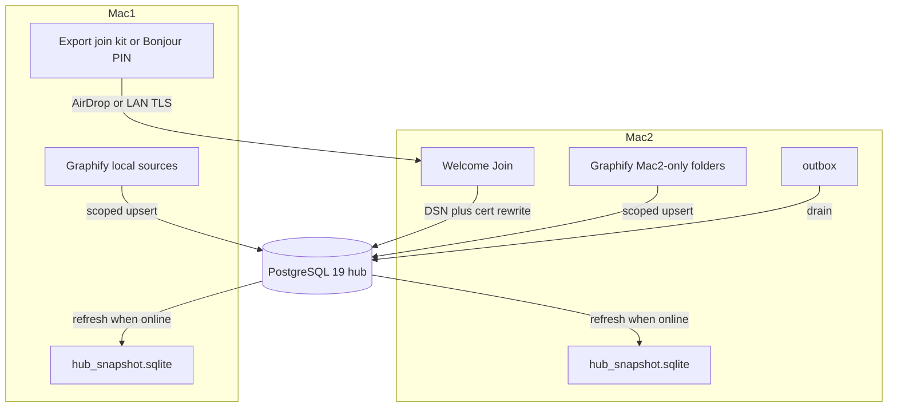

# Multi-Mac hub join, graph feeders, airplane snapshot

**Status:** SHIPPED 2026-08-27 — P1–P3 in-tree on `cursor/multi-mac-hub-join` (join kit, Bonjour PIN, scoped graph, `hub_snapshot.sqlite`). Two-Mac live pairing still unverified.

**SSOT:** this file. In-repo pointer: [`.cursor/plans/2026-08-27-multi-mac-hub-join.md`](../../.cursor/plans/2026-08-27-multi-mac-hub-join.md).  
**Cursor UI copy (stale):** `~/.cursor/plans/multi-mac_hub_join_cf530814.plan.md` is outside the repo stamp. It omits **Later** and the desktop `capture_mode` / wiki-cache out-of-scope line. Do not implement from it; do not fork a second plan.

**Branch:** new, from `main` — do **not** stack on [PR #37](https://github.com/mrkinglollipop/Khipu/pull/37) (`cursor/dmg-drag-to-applications`; DMG + Docker only).  
**Not this slice:** Supabase/Google/Apple login, house-hub (expose Mac 1’s localhost Postgres on the LAN), public `:5432`, git-remote identity for duplicate clones, desktop capture_mode / local-wiki-cache UI (see Later).

Linode (or any reachable PG 19) remains the **writer of record**. Each Mac is a client: Keychain DSN, optional Graphify feeder, read replica snapshot for airplane mode. Captures never write the snapshot as if it were live PG.

## Product contract

1. **What this is** — Join an existing Khipu hub from another Mac; publish that Mac’s extra folders into the shared graph; keep a full local copy of hub memory+graph for offline recall.
2. **Primary workflow** — Mac 1: Settings → Set up another Mac → AirDrop/Bonjour. Mac 2: Welcome → Join existing Khipu → connect → Status shows the same episode count as Mac 1. Cursor on Mac 2 `khipu_search` hits the hub. Add a local folder → graph-build → scoped sync → both Macs can `khipu graph` that subtree.
3. **Airplane** — Hub unreachable: MCP/CLI search/graph/get read `hub_snapshot.sqlite` (full last refresh of episodes, topics, revisions, nodes, edges, `memory_embeddings`) plus this Mac’s outbox. Responses tagged `stale: true`. Writes still go to the outbox, never into the snapshot as SSOT.
4. **Out of scope** — Opening Docker Postgres on `0.0.0.0`; Tailscale as a hard requirement (it is one private-net option); merging two offline topic edits beyond existing LWW + `topic_revisions`; productizing a new “local capture mode” in the app (CLI modes already exist — Later).

---

## P1 — Join kit (credentials, not a DB dump)

**Format:** passphrase-encrypted JSON (`Khipu-join.khipujoin`, versioned `khipu-join-v1`). Payload: Keychain secrets (`database_url`, `gemini_api_key`, optional `openai_compat_api_key`), PEM `root.crt` bytes, `capture_mode`, `models` blob, `gateway_url` if set, expected `{episodes, topics, nodes}` counts, created_at. **No** `memory_root` / `graph_sqlite` paths. **No** snapshot (too large for AirDrop pairing).

**Import (load-bearing):** write `root.crt` to [data_dir](packages/cli/khipu/paths.py); **rewrite** DSN `sslrootcert` to that path (Mac 1’s absolute path will not exist — scar from Alzy cert move). Set Keychain via existing `set_dsn` / `set_gemini_key` / `set_openai_compat_key` in [keychain.py](packages/cli/khipu/keychain.py) and the mode-600 `dsn` file fallback (UI: existing `set_khipu_secret`). Restore `models` via [models.py](packages/cli/khipu/models.py) and `capture_mode` via [config.py](packages/cli/khipu/config.py).

**Refuse join** if host is `127.0.0.1` / `localhost` / `::1`: copy that this database lives only on the other Mac; a second computer cannot join localhost Postgres. Connect failure: name `HOST:PORT` unreachable (Tailscale / WireGuard / SSH / shared server) — do not blame the file first.

**After connect:** `check_remote_postgres` + live `COUNT(*)` vs the join-kit payload’s expected `{episodes, topics, nodes}` counts (**not** `hub_snapshot.sqlite` — that file is P3 and is not in the kit). Mismatch of “expected N, got 0” is a hard stop. Pending migrations only (idempotent; no table wipe — [migrate.py](packages/cli/khipu/migrate.py), no `TRUNCATE` in [ops/migrations](ops/migrations)).

**CLI:** `khipu join export` / `khipu join import` wrapping the same code the UI uses. Export is the **one** reveal of Keychain DSN: a **dedicated** Tauri command (stdin/file, allowlisted like `set_khipu_secret` in [lib.rs](apps/desktop/src-tauri/src/lib.rs); never print secrets). Do **not** add `join` to `ALLOWED_SUBCOMMANDS` / `run_khipu` argv — that path must not carry a DSN.

**UI:**

- [Welcome.tsx](apps/desktop/src/Welcome.tsx): first fork **Join existing Khipu** vs **Brand-new empty database on this Mac**. Default today is `dbMode === "local"` (line ~171) — that is the empty-brain trap. Join skips Docker/local Postgres entirely.
- [App.tsx](apps/desktop/src/App.tsx) Settings: **Set up another Mac** — passphrase, save file, copy blob, show expected counts + Tailscale-is-optional checklist.

**Nearby Mac (Bonjour):** Mac 1 advertises `_khipu-join._tcp`, 6-digit PIN, ~10 min window, **TLS** transfer of the **same** join payload (rustls or Network.framework). Noise is not in-tree — out of scope for v1. Mac 2 Welcome: Find a Mac nearby. File/AirDrop is the fallback. Pairing is **not** a Postgres tunnel.

---

## P2 — Graph: union feeders, scoped delete

Today [graph_sync.py](packages/cli/khipu/graph_sync.py) mirrors **one** sqlite as the graphify universe, then deletes PG graphify-owned rows not in that sqlite. [should_delete_graphify_node](packages/cli/khipu/sources.py) only spares `membership_off` (disabled/unreachable). [_code_source_for_path](packages/cli/khipu/sources.py) defaults unmatched paths to `code:claude` — a second producer with a skinny source list can **purge** Mac 1’s code nodes.

**Change:**

1. Migration: `nodes.source_id TEXT` (nullable, backfilled on next sync via `source_id_for_graphify_node`). Persist `source_id` on upsert.
2. **Delete only** graphify-owned nodes/edges whose `source_id` is in **this Mac’s enabled AND reachable** source ids **and** missing from this sqlite. Never delete unknown/`NULL` source_id as if they were `code:claude`. Unmatched code paths: **do not** default to `code:claude` for delete.
3. [is_graph_producer](packages/cli/khipu/graph_sync.py) stays false by default (env / `versions.json` `graph_producer` / scheduled_jobs — no new boolean). Join path: after the user adds folders, set `graph_producer` true on this Mac. **Owned source ids** are this Mac’s **enabled and reachable** rows in `graph_sources.json` ([sources.py](packages/cli/khipu/sources.py)) — do **not** add a parallel list in `config.json` or `versions.json`. Delete and drift use that list, not “I own the whole graph.”
4. Welcome Graph after join: keep Graphify install; **Add folders on this Mac** (`graph_sources.json` already per data dir; [default_document](packages/cli/khipu/sources.py) `sources: []`). Skip = reader-only. First `graph-build` + scoped `sync_from_sqlite`.
5. Doctor `graph_drift`: if not producer, keep skip. If producer, drift only those owned (enabled and reachable) source ids (so Mac 2 is not red for Mac 1’s sqlite). Unreachable/disabled ids stay in `membership_off` (existing spare).

Conversation-memory / Khipu-owned nodes stay undeletable by Graphify (existing `KHIPU_OWNED_NODE_SQL`).

**Conflicts (already shipped, document only):** episodes `ON CONFLICT DO NOTHING` on `(ts, md5(summary))`; topics LWW with [topic_revisions](packages/cli/khipu/revisions.py); graph same `id` last upsert wins. No new merge UI. Same clone at two paths = duplicate nodes in v1 (call out in Settings copy).

---

## P3 — Airplane mode: full hub snapshot (chosen)

**Not** a second Postgres. **Not** writes to the snapshot.

When hub connect succeeds (app launch, doctor, Welcome finish, explicit refresh): atomically replace `hub_snapshot.sqlite` under the data dir with a dump of:

- `episodes`, `topics`, `topic_revisions`
- `nodes`, `edges`
- `embedding_profiles`, `memory_embeddings` (store `vector` as float32 blob)

Skip ops-only tables (`ops_events`). Refresh is **full replace**, not incremental v1 (simpler; hub is the SSOT). Show size + `refreshed_at` in Settings / doctor.

**Read path:** [db.connect](packages/cli/khipu/db.py) stays **Postgres-only** (writers, migrate, graph_sync, capture). Do **not** point `connect()` at `hub_snapshot.sqlite` — that would make the snapshot a write SSOT. Search / graph / get / MCP in [mcp_server.py](packages/cli/khipu/mcp_server.py) (and CLI equivalents): try hub with a short timeout; on failure, open a **separate** sqlite connection to the snapshot + merge [outbox](packages/cli/khipu/outbox.py) payloads as extra episodes. Every stale result includes `stale: true` and `snapshot_refreshed_at`. `khipu_status` / doctor: hub down is red; snapshot age is a separate signal (not “green amnesia”).

**Graph offline:** reuse hop/CTE neighbor logic against sqlite `nodes`/`edges`. Do **not** require SQL/PGQ `GRAPH_TABLE` in sqlite (PG 19-only). Keyword search: port [_search_query](packages/cli/khipu/cli.py) ILIKE/token coverage to sqlite. **Semantic:** if local embed provider is configured, embed the query locally and cosine against snapshot blobs; else semantic flag errors with “hub unreachable, keyword only” — do not call Gemini while offline and pretend.

**Reconnect:** existing outbox drain; then snapshot refresh; then scoped graph sync if this Mac is a feeder. Topic LWW unchanged.

README FAQ line “Reads keep working from a local cache” becomes this snapshot — today it is **unverified / false**.

**Capture modes (already shipped — not a new mode in this slice):** [`capture_mode`](packages/cli/khipu/config.py) is `legacy` | `dual` | `hub` via `khipu config --set-capture-mode` (default **`dual`**). `legacy` = capture_v2 files only; `dual` = PG + files; `hub` = PG + outbox, reverse-mirror to files unless `KHIPU_HUB_FILE_MIRROR=0`. Desktop Settings has **no** capture_mode control (**verified**). Offline writes already queue the [outbox](packages/cli/khipu/outbox.py); `dual`/`hub` still run capture_v2 when `memory_root`/`capture_v2` are configured. There is **no** auto-switch to `legacy` when the hub is down, and MCP recall still does not search the markdown wiki. Do **not** treat `legacy` as airplane mode (it stops hub writes). Portable opt-in Application Support `wiki/` cache was planned in the DMG plan and is **not** a Settings switch — Later.

---

## Later (not this build)

- Settings UI for `capture_mode` (`legacy` / `dual` / `hub`) so people can turn local file-wiki writes on without the CLI.
- Opt-in local wiki cache under Application Support (portable plan: `KHIPU_HUB_FILE_MIRROR` + folder picker), then optionally search those files when snapshot is also missing.
- Do **not** auto-flip to `legacy` on airplane: that drops Linode as writer of record. Keep outbox + snapshot as v1 offline; file wiki is an extra mouth for operators who already have `memory_root`.

---

## Verification (oracles)

- Unit: join cert rewrite + localhost refuse; scoped delete (Mac 2 sqlite must not delete Mac 1 `source_id`); snapshot search/graph when hub `connect()` raises (read paths use a separate sqlite handle; `connect()` itself stays PG-only); outbox merge; `_code_source_for_path` delete default gone.
- `npx tsc --noEmit` in `apps/desktop`; existing `test_graph_sync` / `test_sources` / `test_mcp_server` extended.
- **Unverified until two Macs:** Bonjour PIN, AirDrop, live Linode count match, snapshot size on the real hub, airplane SessionStart.

## Docs

Update [README.md](README.md) second-Mac paragraph (today “repeat steps 1, 2 and 5”) and the offline FAQ (snapshot, not the false “local cache”; mention existing CLI `capture_mode`, not a new desktop toggle). Plan Status → SHIPPED in this file when merged (Night School 40).
